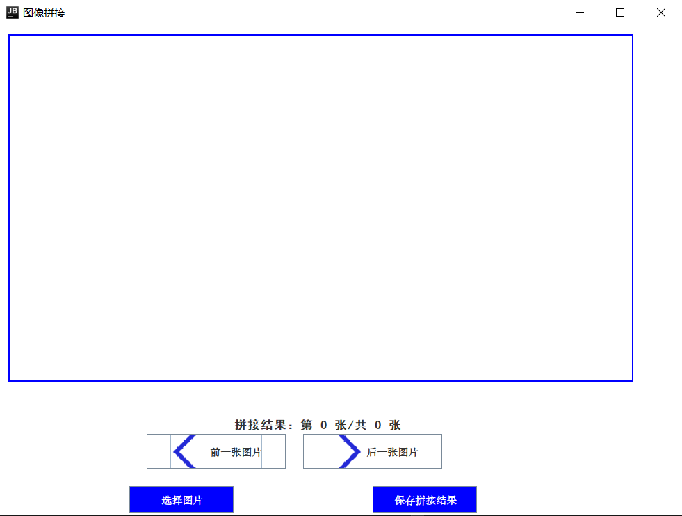
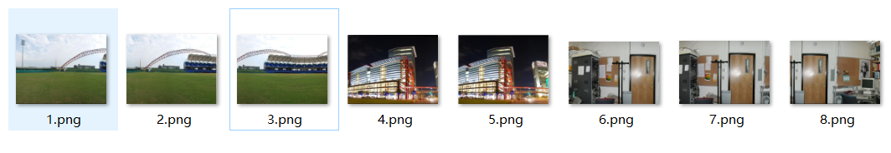
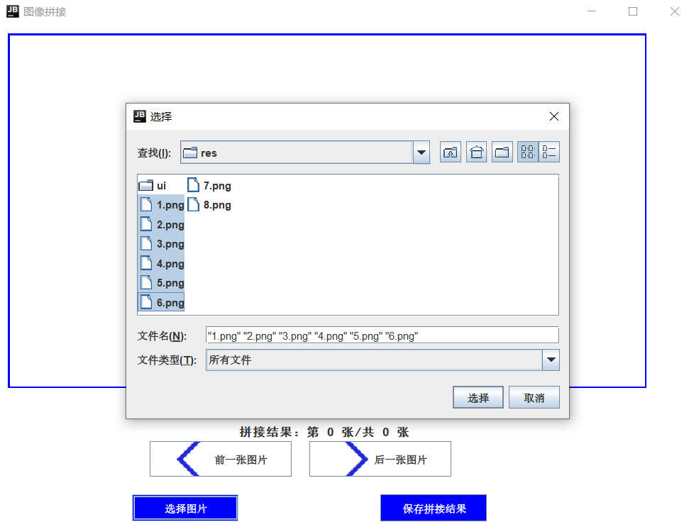
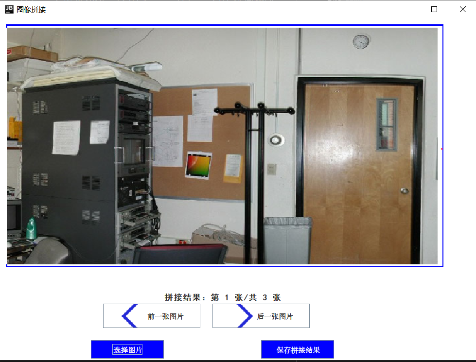
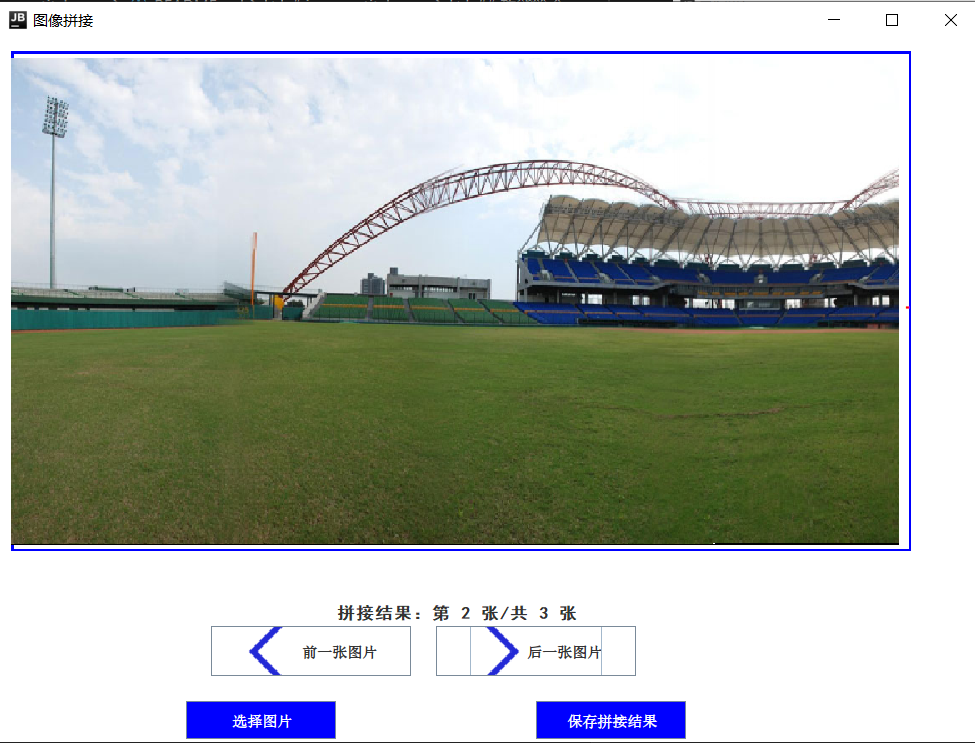
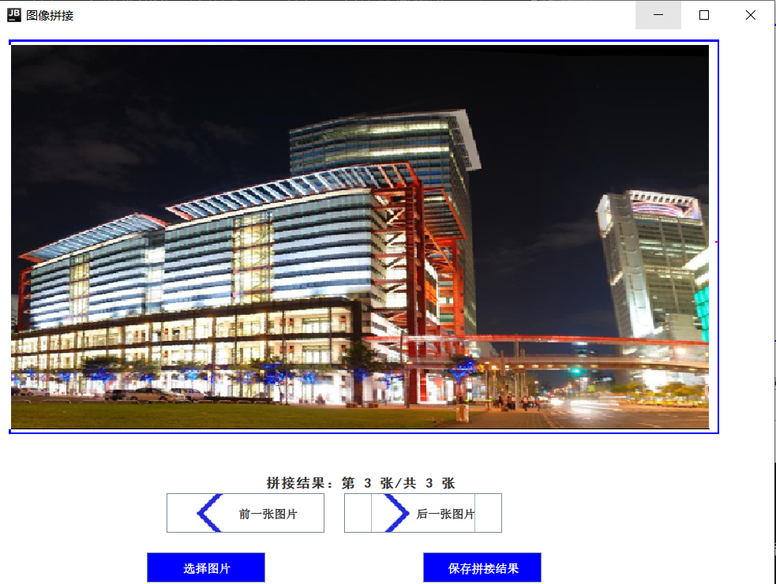

# image_stitch_app

图片拼接程序 (Image stitching application)

## 程序简介

该程序实现对图片的拼接。选择多个图片，该程序会对选择的图片中所有可以拼接的图片进行拼接，最终将生成所有的拼接结果。\
图片的拼接使用C++编写，使用OpenCV 以及 OpenCV contrib 库实现，并编译构建为dll链接库供java程序调用。

## 功能简介

运行该程序后，首先选择多个图片。选择完成之后，程序将会对选择的图片进行拼接。最终可以在程序的主界面上浏览拼接后的结果。

1. 选择图片进行拼接\
下图中是一些场景中的图片。

选择其中的一部分图片。正确的拼接结果应该是图片1，2，3拼接在一起，图片4，5拼接在一起，图片6无法和其他的图片进行拼接。

2. 浏览拼接结果\
拼接结束后可以看到对选择的图片拼接的结果，如下图所示。

